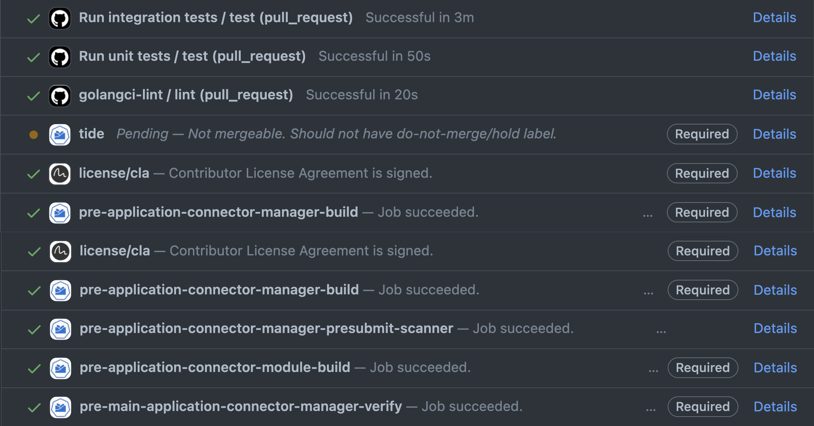

# Install Application Connector Manager 

- [Install Application Connector Manager](#install-application-connector-manager)
  - [Install Application Connector Manager from the local sources](#install-application-connector-manager-from-the-local-sources)
    - [Prerequisites](#prerequisites)
    - [Procedure](#procedure)
  - [Make targets to run Application Connector Manager locally on k3d](#make-targets-to-run-application-connector-manager-locally-on-k3d)
    - [Run Application Connector Manager on bare k3d](#run-application-connector-manager-on-bare-k3d)
  - [Install Application Connector module on remote Kyma runtime](#install-application-connector-module-on-remote-kyma-runtime)
    - [Prerequisite](#prerequisite)
    - [Procedure](#procedure-1)

Learn how to install the Application Connector module locally (on k3d) or on your remote cluster.

## Install Application Connector Manager from the local sources 

### Prerequisites

- Access to a Kubernetes (v1.24 or higher) cluster
- [Go](https://go.dev/)
- [Docker](https://www.docker.com/)
- [kubectl](https://kubernetes.io/docs/tasks/tools/)
- [kubebuilder](https://book.kubebuilder.io/)

### Procedure

You can build and run the Application Connector Manager in the Kubernetes cluster without Kyma.
For the day-to-day development on your machine, you don't always need to have it controlled by Kyma's Lifecycle Manager.

Run the following commands to deploy Application Connector Manager on a target Kubernetes cluster, such as k3d:

1. Clone the project.

   ```bash
   git clone https://github.com/kyma-project/application-connector-manager.git && cd application-connector-manager/
   ```

2. Set the Application Connector Manager image name.

   > NOTE: You can use the local k3d registry or your Docker Hub account to push intermediate images.  
   ```bash
   export IMG=<DOCKER_USERNAME>/custom-application-connector-manager:0.0.1
   ```

3. Test the code.

   ```bash
   make test
   ```
4. Build and push the image to the registry.

   ```bash
   make module-image
   ```
5. Create a target Namespace.

   ```bash
   kubectl create ns kyma-system
   ```

6. Deploy Application Connector Manager.

   ```bash
   make deploy
   ```

7. Verify if Application Connector Manager is deployed.

   ```bash
   kubectl get deployments -n kyma-system
   ```

   You should get a result similar to this example:

   ```
   NAME                                       READY   UP-TO-DATE   AVAILABLE   AGE
   application-connector-controller-manager   1/1     1            1           20s
   ```

## Make targets to run Application Connector Manager locally on k3d

### Run Application Connector Manager on bare k3d

When using a local k3d cluster, you can also use the local OCI image registry that comes with it.
Thanks to that, you don't need to push the Application Connector module images to a remote registry and you can test the changes in the Kyma installation set up entirely on your machine.

1. Clone the project.

   ```bash
   git clone https://github.com/kyma-project/application-connector-manager.git && cd application-connector-manager/
   ```
2. Build the manager locally and run it on the k3d cluster.

   ```bash
   make -C hack/local run-without-lifecycle-manager
   ```
3. If you want to clean up the k3d cluster, use the `make -C hack/local stop` make target.

## Install Application Connector module on remote Kyma runtime

### Prerequisite
Lifecycle Manager must be installed on the cluster (locally), or the cluster itself must be managed remotely by the central control-plane.

### Procedure
In this section, you will learn how to install a pull request (PR) version of the Application Connector module with Lifecycle Manager on a remote cluster.
You need OCI images for the Application Connector module version to be built and pushed into a public registry. You also need ModuleTemplate matching the version to apply it on the remote cluster.
CI jobs running on PRs and on the main branch help you to achieve that.

1. Create a PR or use an existing one in the [`application-connector-manager`](https://github.com/kyma-project/application-connector-manager) repository. 
2. On the PR page, scroll down to the Prow jobs status list. 

   

3. After the job has finished with success, click **Details** next to the `pull-application-connector-module-build` job.

   

The ModuleTemplate will be printed in the MODULE TEMPLATE section, between the tags.

> `~~~~~~~~~~~~BEGINING OF MODULE TEMPLATE~~~~~~~~~~~~~~`

   ```yaml
   apiVersion: operator.kyma-project.io/v1alpha1
   kind: ModuleTemplate
   metadata:
   name: moduletemplate-application-connector
   ...
   ```

> `~~~~~~~~~~~~~~~END OF MODULE TEMPLATE~~~~~~~~~~~~~~~~`

<details>
<summary><b>Example of full job build result</b></summary>

   ```text
.1.8
go: downloading github.com/mattn/go-isatty v0.0.12
go: downloading sigs.k8s.io/json v0.0.0-20220713155537-f223a00ba0e2
go: downloading gopkg.in/inf.v0 v0.9.1
go: downloading golang.org/x/sys v0.0.0-20220722155257-8c9f86f7a55f
go: downloading golang.org/x/net v0.0.0-20220722155237-a158d28d115b
go: downloading golang.org/x/mod v0.6.0-dev.0.20220419223038-86c51ed26bb4
go: downloading github.com/json-iterator/go v1.1.12
go: downloading github.com/go-logr/logr v1.2.3
go: downloading github.com/modern-go/concurrent v0.0.0-20180306012644-bacd9c7ef1dd
go: downloading github.com/modern-go/reflect2 v1.0.2
go: downloading golang.org/x/text v0.3.7
/home/prow/go/src/github.com/kyma-project/application-connector-manager/bin/controller-gen rbac:roleName=manager-role crd webhook paths="./..." output:crd:artifacts:config=config/crd/bases
cd config/manager && /home/prow/go/src/github.com/kyma-project/application-connector-manager/bin/kustomize edit set image controller=europe-docker.pkg.dev/kyma-project/dev/application-connector-manager:PR-73
/home/prow/go/src/github.com/kyma-project/application-connector-manager/bin/kustomize build config/default > application-connector-manager.yaml
bash: line 1: gcloud: command not found
cd config/manager && /home/prow/go/src/github.com/kyma-project/application-connector-manager/bin/kustomize edit set image controller=europe-docker.pkg.dev/kyma-project/dev/application-connector-manager:PR-73
WARNING: This command is experimental and might change in its final version. Use at your own risk.
- Module built
- Default CR validation succeeded
- Module archive created
- Adding layers to archive...
- Security scanning configured
- Module successfully pushed to "europe-docker.pkg.dev/kyma-project/dev/unsigned"
- Template successfully generated at moduletemplate.yaml
make[1]: Leaving directory '/home/prow/go/src/github.com/kyma-project/application-connector-manager'
\n~~~~~~~~~~~~BEGINING OF MODULE TEMPLATE~~~~~~~~~~~~~~
apiVersion: operator.kyma-project.io/v1beta2
kind: ModuleTemplate
metadata:
  name: application-connector-fast
  namespace: kcp-system
  labels:
    "operator.kyma-project.io/module-name": "application-connector"
  annotations:
    "operator.kyma-project.io/doc-url": "https://kyma-project.io/#/application-connector-manager/user/README"
    "operator.kyma-project.io/is-cluster-scoped": "false"
    "operator.kyma-project.io/module-version": "0.0.10-PR-73" 
spec:
  channel: fast 
  data:
    apiVersion: operator.kyma-project.io/v1alpha1
    kind: ApplicationConnector
    metadata:
      namespace: kyma-system
      labels:
        app.kubernetes.io/name: applicationconnector
        app.kubernetes.io/instance: applicationconnector-sample
        app.kubernetes.io/part-of: application-connector-manager
        app.kuberentes.io/managed-by: kustomize
        app.kubernetes.io/created-by: application-connector-manager
      name: applicationconnector-sample
    spec: {}
  descriptor:
    component:
      componentReferences: []
      labels:
      - name: security.kyma-project.io/scan
        value: enabled
        version: v1
      name: kyma-project.io/module/application-connector
      provider: '{"name":"kyma-project.io","labels":[{"name":"kyma-project.io/built-by","value":"cli","version":"v1"}]}'
      repositoryContexts:
      - baseUrl: europe-docker.pkg.dev/kyma-project/dev/unsigned
        componentNameMapping: urlPath
        type: OCIRegistry
      resources:
      - access:
          globalAccess:
            digest: sha256:0bae5aaacc545d1ce3e2f006622db906080035de33d03de3e909bc20c26d5349
            mediaType: application/octet-stream
            ref: europe-docker.pkg.dev/kyma-project/dev/unsigned/component-descriptors/kyma-project.io/module/application-connector
            size: 18727
            type: ociBlob
          localReference: sha256:0bae5aaacc545d1ce3e2f006622db906080035de33d03de3e909bc20c26d5349
          mediaType: application/octet-stream
          type: localBlob
        name: raw-manifest
        relation: local
        type: yaml
        version: 0.0.10-PR-73
      - access:
          imageReference: europe-docker.pkg.dev/kyma-project/prod/application-connector-manager:v20231013-6f235afa
          type: ociRegistry
        labels:
        - name: scan.security.kyma-project.io/type
          value: third-party-image
          version: v1
        name: application-connector-manager
        relation: external
        type: ociImage
        version: v20231013-6f235afa
      sources:
      - access:
          commit: 4878b1dc6ea8f4d56e56ab854c0bf13129c9cfe1
          repoUrl: https://github.com/kyma-project/application-connector-manager
          type: gitHub
        labels:
        - name: git.kyma-project.io/ref
          value: refs/heads/main
          version: v1
        - name: scan.security.kyma-project.io/dev-branch
          value: ""
          version: v1
        - name: scan.security.kyma-project.io/rc-tag
          value: ""
          version: v1
        - name: scan.security.kyma-project.io/language
          value: golang-mod
          version: v1
        - name: scan.security.kyma-project.io/exclude
          value: '**/*_test.go'
          version: v1
        name: module-sources
        type: Github
        version: 0.0.10-PR-73
      version: 0.0.10-PR-73
    meta:
      schemaVersion: v2
\n~~~~~~~~~~~~~~~END OF MODULE TEMPLATE~~~~~~~~~~~~~~~~
make: Leaving directory '/home/prow/go/src/github.com/kyma-project/application-connector-manager/hack/ci'
   ```
</details>

   4. Save the section's content in the local YAML file.

   4. Apply ModuleTemplate on your remote cluster:

   ```bash
   kubectl apply -f <saved_module_template_path>
   ```

   5. Enable the Application Connector Manager module by patching the Kyma CRD.

   ```bash
   make -C hack/common module
   ```
