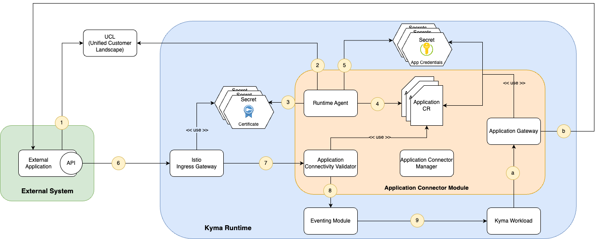

# Application Connector Module

## What is Application Connectivity in Kyma?

Application Connectivity in Kyma simplifies the interaction between external systems and your Kyma workloads. The main benefits are:

* Smooth and loosely coupled integration of external systems with Kyma workloads using [Kyma Eventing](https://kyma-project.io/#/eventing-manager/user/README)

* Easy consumption of SAP BTP services by supporting the SAP BTP Extensibility approach

* Establishing high-security standards for any interaction between systems by using trusted communication channels and authentication methods

* Reducing configuration changes for Kyma workloads through encapsulating configuration details of external API endpoints

* Monitoring and tracing capabilities to facilitate operational aspects

## Application Connector Module

The Application Connector module bundles all features of Application Connectivity in Kyma. You can install and manage the module using Kyma dashboard.

The module includes Kubernetes operators and is fully configurable over its own Kubernetes custom resources (CRs). For each external system, a dedicated configuration is used. This allows for individual configuration of security aspects (like encryption and authentication) per system.

Besides proxying any ingress and egress requests to external systems and dealing with security concerns, it also includes full integration with SAP BTP Unified Customer Landscape (UCL) to simplify the consumption of SAP BTP services.

## Features

The Application Connector module provides the following features:

* Easy installation of Kyma's Application Connectivity capabilities by enabling the Application Connector module in your Kyma Runtime.

* Simple configuration using Kubernetes CRs and easy management with Kyma dashboard.

* Full integration of BTP's UCL service, which implements the SAP BTP Extensibility concept. This allows for the automated integration of external systems registered in the UCL service.

* Dispatching of incoming requests from external systems to Kyma workloads (for example, a Kyma Serverless Function) by using an Istio Gateway with mTLS and the Kyma Eventing module.

* Proxying outgoing requests to external APIs and transparently covering security requirements like encryption and authentication (like OAuth 2.0 + mTLS, Basic Auth, and Client Certificates).

* Metering of throughput and exposing monitoring metrics.

### Options for integrating external systems

#### Automatically by UCL

If an external systems is registered for the Kyma Runtime in BTP's UCL (Unified Customer Landscape), it's automatically configured by the Application Connector and able to send requests to Kyma workloads. The Application Connector Modules includes a [`Runtime Agent`](components/00-10-runtime-agent.md) and acts as client of the UCL backend. It retrieves automatically the configuration of each external system and integrates it with Kyma.

An example how a system can be registered in UCL and gets integrated into a Kyma Runtime is provided in [this tutorial](tutorials/mode-ucl/README.md).

#### Manually

It is always possible to integrate any exernal system into Kyma by applying the configuration by hand. The steps for configuring and integrating a new external system in your Kyma Runtime are described in [this tutorial](tutorials/mode-manual/README.md).

## Architecture

The diagram shows all components of the Application Connector Module. It describes the workflow how the different components of the Application connector module integrate an external system into Kyma.

### Components

To get more details of a particular component, please follow the link.

|Component|Purpose|
|--|--|
|External Application|The external system which wants to interact with your Kyma workload or should be called by it.|
|UCL|The UCL system implements the BTP Extensibility Concept and administrates system formations.|
|[Runtime Agent](./technical-reference/runtime-agent/README.md)|The Runtime Agent is a client of the UCL system. It synchronizes regularly the defined system formations and integrates them into the Kyma Runtime.|
|Certificate Secret|Stores the UCL managed certificates used for trusted communication between the external system and Kyma.|
|[Application Custom Resource (CR)](./resources/06-10-application.md)|Stores metadata of the external system (like endpoints, authentication method etc.). Each Application CR corresponds to a single external system.|
|Application Credentials Secret|Stores endpoint/API credentials of the external system.|
|[Istio Ingress Gateway](./technical-reference/04-10-istio-gateway.md)|The Application Connector Module uses an Istio Gateway as endpoint for incoming requests from external systems. The Gateway supports mTLS for establishing trusted connections between the external system and the Kyma Runtime.|
|Application Connectivity Validator|Verifies incoming requests by analying the certificate subject and passes the request to the Kyma eventing module.|
|Eventing Module|The Kyma Eventing Module is used for dispatching incoming requests from external systems to Kyma worloads.|
|Kyma Workload|Can be a customer workload (e.g. deployed applications) or any Kyma hosted serverless function.|
|[Application Gateway](./technical-reference/04-20-application-gateway.md)|This component acts as an proxy for outgoing communication from a Kyma workload to an external system. It supports various types of authentication methods.|
|Application Connector Manager|This Kubernetes Operator takes care of the installation and configuration of all Application Connector module components in the Kyma Runtime. It manages the lifecycle of the Application Connector module based on the dedicated ApplicationConnector custom resource (CR).|

### Workflow

The workflow in the diagram shows the steps from registering an external system at UCL until it is able to interact with Kyma workloads. Some steps are only relevant when the integartion of the external system is managed manually, but all of them will be applied when the integration happens automatically via UCL.

<table>
    <tr>
        <th>Step</th>
        <th>Description</th>
        <th>Manual integration</th>
        <th>Integration by UCL</th>
    </tr>
    <tr>
        <td colspan="4"><strong>Inbound communciation</strong></td>
    </tr>
    <tr>
        <td>1</td>
        <td>The external system is registered in the UCL system (Unified Customer Landscape) and configured in a UCL system formation for the Kyma Runtime.</td>
        <td></td>
        <td>X</td>
    </tr>
    <tr>
        <td>2</td>
        <td>Runtime Agent connects to the UCL system and gathers all registered applications for this Kyma Runtime.</td>
        <td></td>
        <td>X</td>
    </tr>
    <tr>
        <td>3</td>
        <td>The agent retrieves from UCL the cryptograhical certificates used for securing the communication between the external system and Kyma. The certificate is stored in a Kubernetes secret.</td>
        <td></td>
        <td>X</td>
    </tr>
    <tr>
        <td>4</td>
        <td>Additionally, application metadata of the external system (e.g. authentication type, API endpoints etc.) are stored in an Application custom resource (CR).</td>
        <td>X This manual step is applied by an administrator</td>
        <td>X Step is automatically applied by Runtime Agent</td>
    </tr>
    <tr>
        <td>5</td>
        <td>Finally, the Runtime Agent stores the credentials for accessing the API of an external system in a Kubernetes secret.
These credentials are used for outbound communication proxied by the Application Gateway.</td>
        <td></td>
        <td>X</td>
    </tr>
    <tr>
        <td>6</td>
        <td>The external systems communicate with the Kyma Runtime trough the Istio Ingress Gateway.</td>
        <td>X</td>
        <td>X</td>
    </tr>
    <tr>
        <td>7</td>
        <td>Istio gateway is using the provided certificate for securing the communication via mTLS.</td>
        <td></td>
        <td>X</td>
    </tr>
    <tr>
        <td>8</td>
        <td>Incoming calls are verified by the Connectivity Validator by investigating the subject of the certificate. It finally forwards the request to the inbound handler of the Eventing component.</td>
        <td></td>
        <td>X</td>
    </tr>
    <tr>
        <td>9</td>
        <td>Kyma workloads can receive incoming events and process them.</td>
        <td>X</td>
        <td>X</td>
    </tr>
    <tr>
        <td colspan="4"><strong>Onbound communciation</strong></td>
    </tr>
    <tr>
        <td>a</td>
        <td>The Application Gateway acts as an proxy for any outbound communication from a Kyma workload to an external system API.</td>
        <td>X</td>
        <td>X</td>
    </tr>
    <tr>
        <td>b</td>
        <td>The Application Gateway takes care about security and authentication during the conversation with the external system API.</td>
        <td>X</td>
        <td>X</td>
    </tr>
</table>

