 [Tobias Schuhmacher](https://people.wdf.sap.corp/profiles/I539990) - Product Owner of Team Framefrog, Kyma runtime

Last update: Oct 2024

# Integrate Kyma with SAP Commerce Cloud

## Table of Contents

- [Integrate Kyma with SAP Commerce Cloud](#integrate-kyma-with-sap-commerce-cloud)
  - [Table of Contents](#table-of-contents)
  - [Introduction](#introduction)
    - [Prerequisites](#prerequisites)
  - [Initial Setup](#initial-setup)
    - [Create a Kyma instance in the BTP Cockpit and Add the Required Modules](#create-a-kyma-instance-in-the-btp-cockpit-and-add-the-required-modules)
    - [Configure a System Landscape in the BTP Cockpit](#configure-a-system-landscape-in-the-btp-cockpit)
  - [Process SAP Commerce Cloud Events by Kyma Workload](#process-sap-commerce-cloud-events-by-kyma-workload)
    - [Expose Parts of the SAP Commerce Cloud API](#expose-parts-of-the-sap-commerce-cloud-api)
    - [Create a Serverless Function for Event Processing](#create-a-serverless-function-for-event-processing)
    - [Create a Subscription to the Serverless Function for Events From SAP Commerce Cloud API](#create-a-subscription-to-the-serverless-function-for-events-from-sap-commerce-cloud-api)
    - [Trigger Events in SAP Commerce Cloud and Process Them in Kyma](#trigger-events-in-sap-commerce-cloud-and-process-them-in-kyma)
  - [Common Problems](#common-problems)
    - [Registration Fails Due to Token URL Invalidity](#registration-fails-due-to-token-url-invalidity)
    - [Registration Fails Due to Connectivity Issues](#registration-fails-due-to-connectivity-issues)
    - [Serverless Function Is Not Triggered](#serverless-function-is-not-triggered)

## Introduction

The document describes the steps for connecting an SAP Commerce Cloud system with a Kyma instance.

In this example, Kyma receives events from an SAP Commerce Cloud Store and processes them in real-time using a Serverless Function.

The SAP Commerce Cloud is integrated with Kyma using the BTP Extensibility Concept. For more information, see [Extensibility Concepts](https://help.sap.com/docs/btp/sap-business-technology-platform/extensibility-concepts).

### Prerequisites

Besides the Kyma default modules like Istio and API Gateway, you must enable the following Kyma modules:

* `Application Connector` acting as a client for the BTP extensibility mechanism
* `Serverless` to run a Function that is processing SAP CX events
* `Eventing` to receive and dispatch incoming events from SAP Commerce Cloud to the Serverless Function
* `NATS` as an extension of the Eventing module, which includes an in-memory eventing backend.

## Initial Setup

### Create a Kyma instance in the BTP Cockpit and Add the Required Modules

1. [Create a Kyma instance](https://help.sap.com/docs/btp/sap-business-technology-platform/create-kyma-environment-instance) in the BTP Cockpit

2. Open Kyma dashboard

   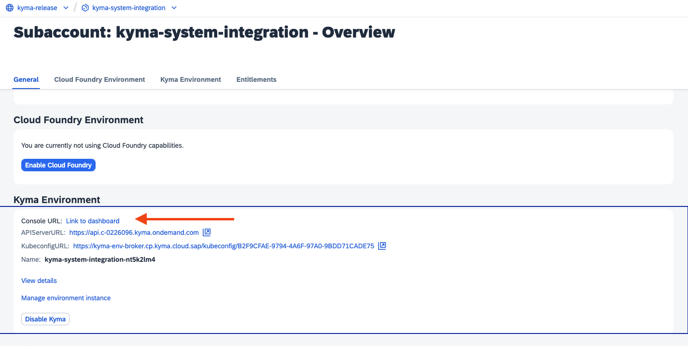

3. Add the following Kyma modules using Kyma dashboard: `Application Connector`, `Eventing`, `NATS`, and `Serverless`. See the [Add and Delete a Kyma Module](https://help.sap.com/docs/btp/sap-business-technology-platform/enable-and-disable-kyma-module?#add-and-delete-a-kyma-module-using-kyma-dashboard) tutorial, to learn how to do it.

4. Configure NATS as a backend for the Eventing module. This will change the status of the Eventing module from  `Warning` to `Ready`.

   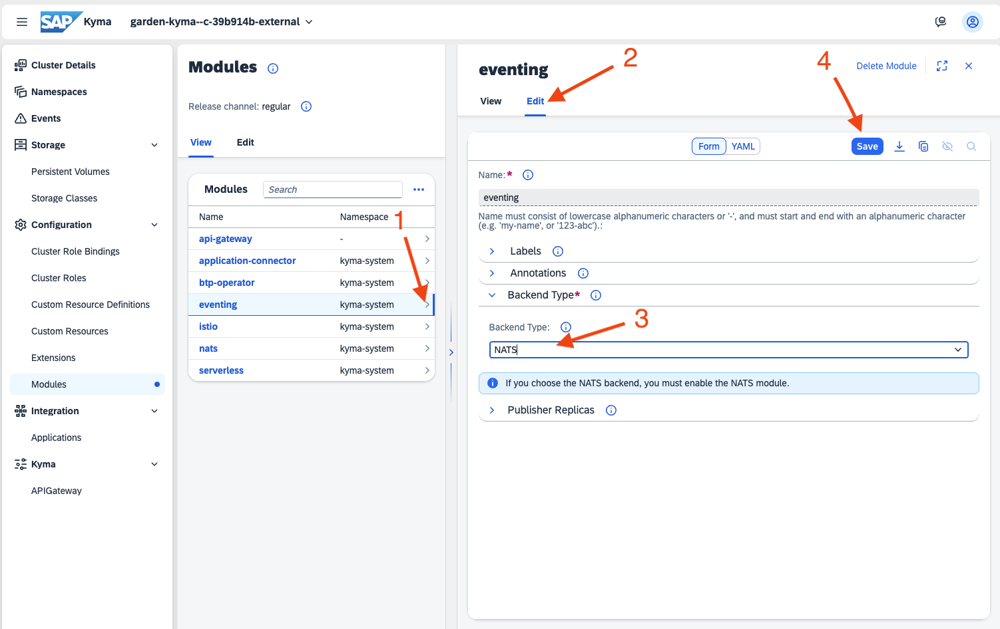

### Configure a System Landscape in the BTP Cockpit

1. Open your Global Account, and navigate to **System Landscape**

   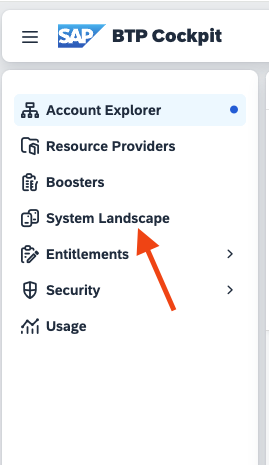

2. Click on **Add System** and create a **SAP Commerce Cloud** system 

    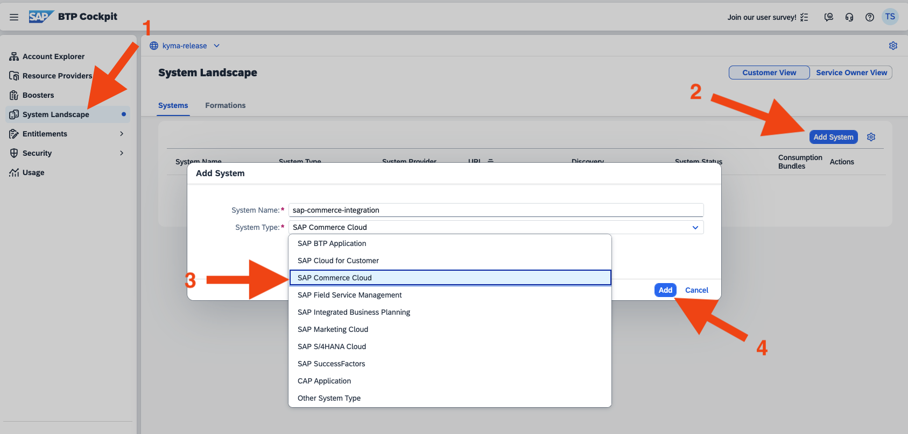

3. To start the formation creation wizard, switch to the **Formations** tab and click `Create Formation`.

   * As a `Formation Type` use `Side-By-Side Extensibility with Kyma`
    

   * Attach the system created before (see step 2), click on **Next Step**, and create the formation
     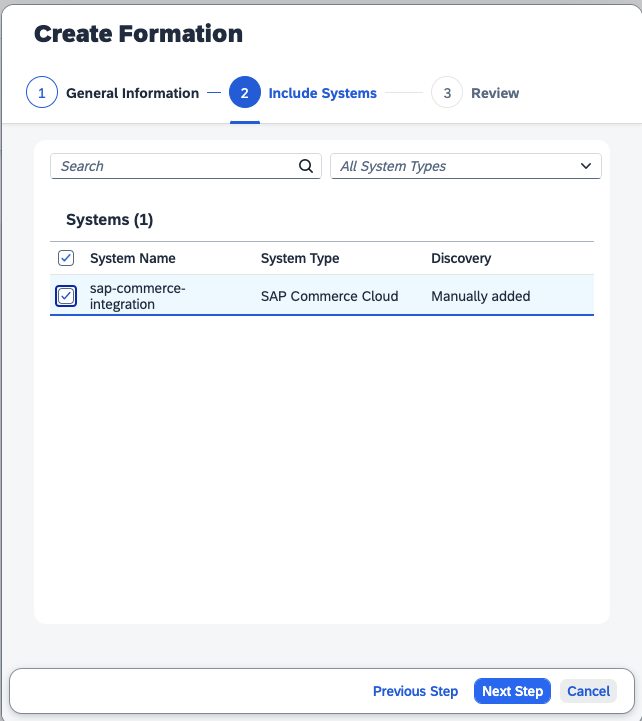

     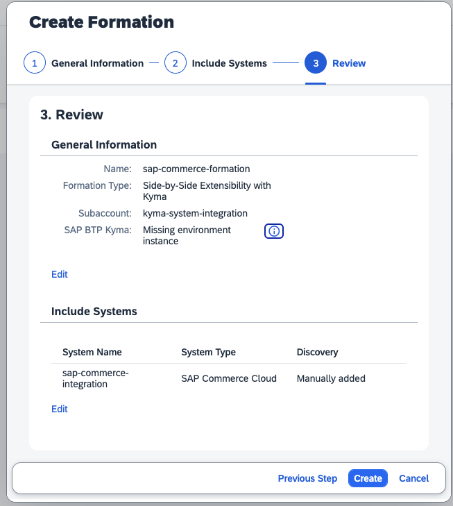

4. Switch to your Kyma dashboard and check whether the connected SAP Commerce system appears as an integrated application (sometimes, it can take 10 minutes until the integration becomes visible in Kyma).

    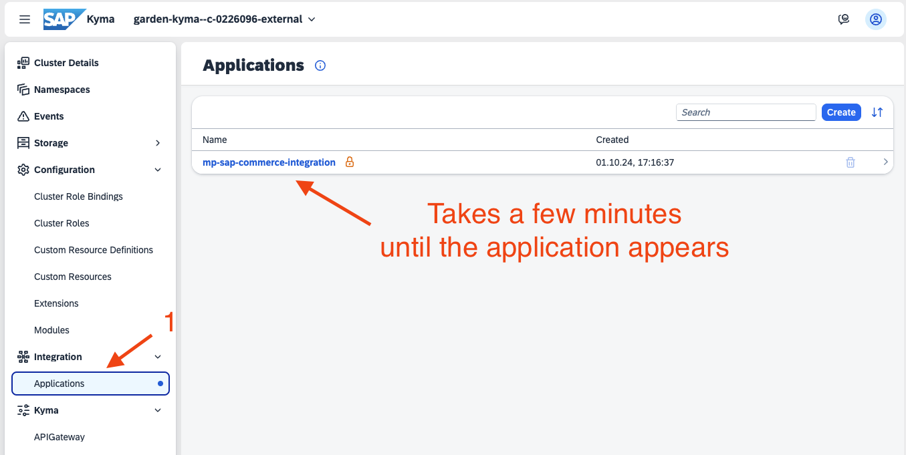

## Process SAP Commerce Cloud Events by Kyma Workload

### Expose Parts of the SAP Commerce Cloud API

See also [Configure an Event Notification](https://help.sap.com/docs/sap-cloud-for-customer/d5fec61c279741048109d851d4d3d1ad/a84a5e9266264af8ac32fe627de10bd7.html).

1. [Log in to SAP Commerce Cloud Administration Cockpit](https://wiki.one.int.sap/wiki/display/CXCOMPGMRM/Patch+Release+Testing+CCv2+Landscape) (aka backoffice), using the provided admin credentials. For testing, use the hosted SAP Commerce Cloud System with the latest Patch release.

   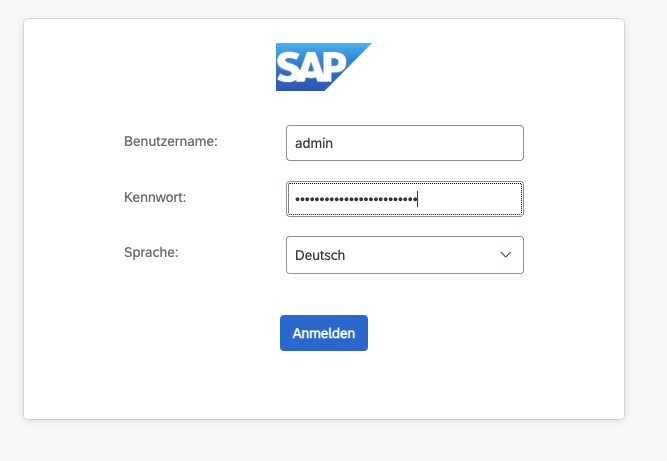

2. Configure the BTP system landscape as a destination target in SAP Commerce Cloud.
   1. In BTP Cockpit, open **System Landscape > Systems** and copy the token URL of the configured SAP Commerce Cloud system.

      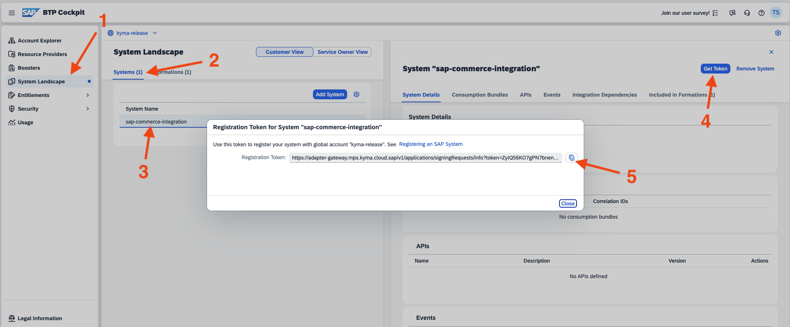

    2. In the Administration Cockpit of SAP Commerce Cloud, navigate to **System > API > Destination Targets** (as a shortcut, use the navigation filter and search for `Destination Targets`). Use the **Default Template** to create a new destination entry.

       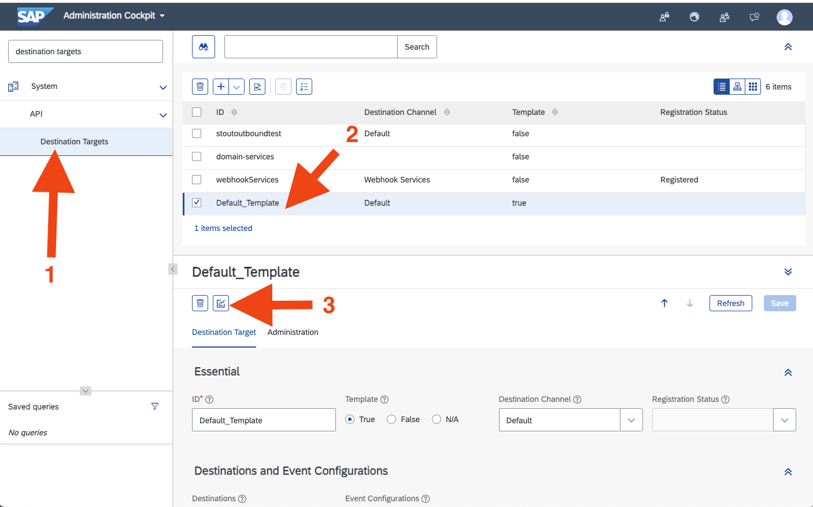

    3. Enter the Token URL from step 1. Be aware that the token URL is only valid for a few minutes. If it's expired, repeat step 1 to get a new URL.

       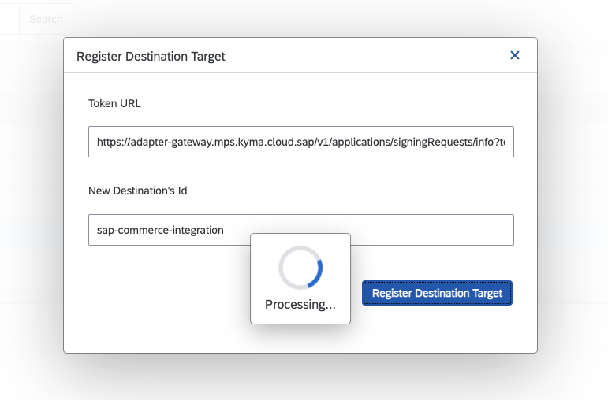

    4. The new destination target is listed in the SAP CX Administration Cockpit. When the registration status changes from `In Progress` to `Registered`, the destination channel is ready to use.

3. The successfully exposed API of the SAP Commerce Cloud System also becomes visible in Kyma. Open Kyma dashboard and navigate to **Integration > Applications**. The consumable API services and events of SAP Commerce Cloud are listed.
 
    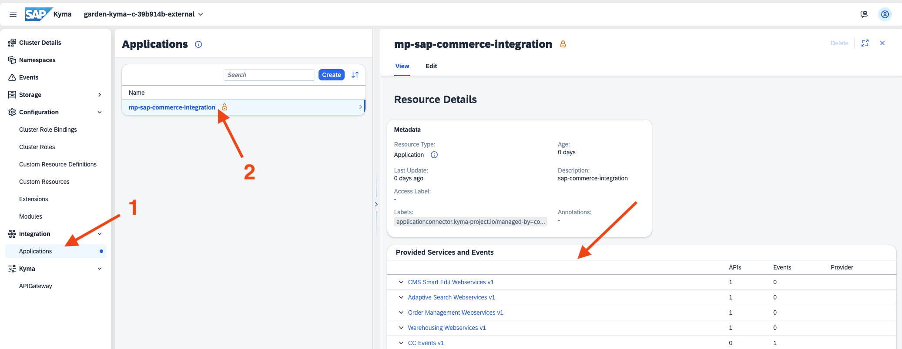

### Create a Serverless Function for Event Processing

1. Go to Kyma dashboard to get the event URL of the SAP Commerce Cloud Webservice API. Navigate to your integrated application and copy the URL of the event source `CC OCC Commerce Webservices v2`. Store this URL temporarily on your computer - it will be needed in one of the following steps.

    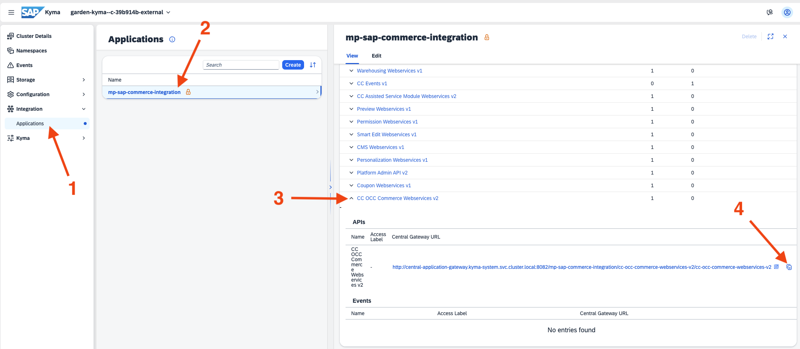.

2. Create a new namespace. Make sure to activate the option `Enable Sidecar Injection`.
 
    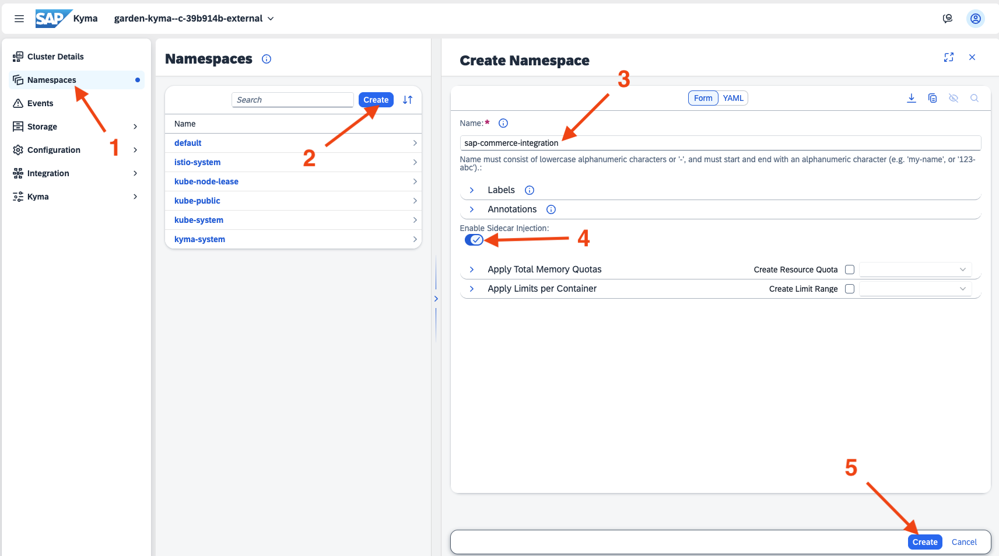

3. Switch to your new namespace (**Namespaces > {Your Namespace}**). Create a Serverless Function under **Workloads > Function**.

      1. Use the template `Node.js Function`.
      2. Copy [this JavaScript code](https://github.tools.sap/kyma/documentation/blob/main/kyma-internal/how-to-guides/release-testing/assets/serverless-cx-events.js) under the **Source** section.
      3. Paste the URL (see step 1) of your event source as a value of `eventSourceURL`.
      4. Finally, add [this dependency](https://github.tools.sap/kyma/documentation/blob/main/kyma-internal/how-to-guides/release-testing/assets/serverless-dependency.json) to your function. Set the name of your function as value for `"name"`. 

    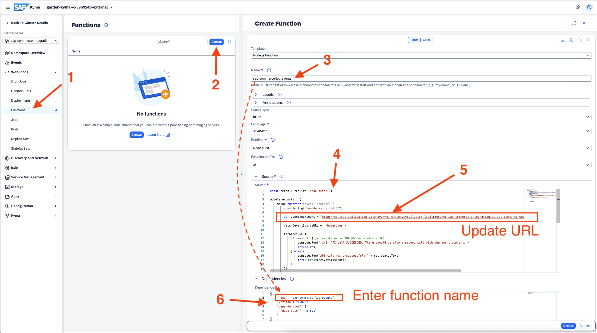

4. The creation of the Serverless Function can take some time.

   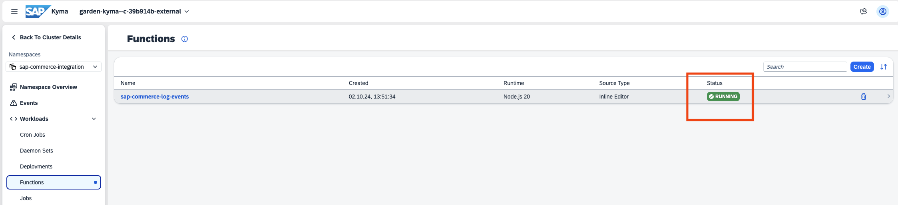

### Create a Subscription to the Serverless Function for Events From SAP Commerce Cloud API

In your namespace, navigate to **Configuration > Subscriptions** and subscribe to events from SAP Commerce Cloud:

 * To get notified when a customer logs in, register for the event type `login.succeeded.v1`.
 * To receive a notification when a new customer gets registered, subscribe to the type `customer.created.v1`.

Use the created Serverless Function as event processing `Service`. Event `Sink` is the URL of the Serverless Function and is filled out automatically.

Finally, set `Type Matching` to `Standard` and the integrated SAP CX application as `Source`.

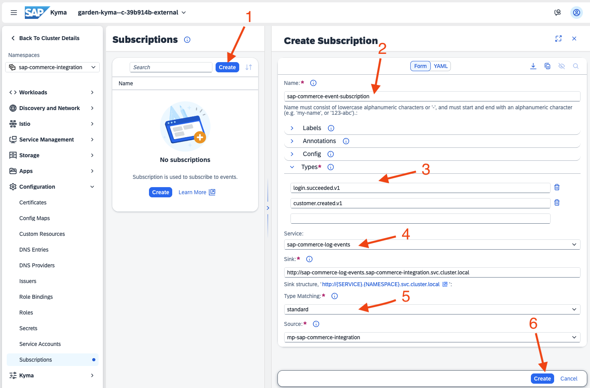

### Trigger Events in SAP Commerce Cloud and Process Them in Kyma

1. Open the SAP Commerce Cloud storefront (e.g., [electronics storefront](https://wiki.one.int.sap/wiki/display/CXCOMPGMRM/Patch+Release+Testing+CCv2+Landscape)) and register a new user.

    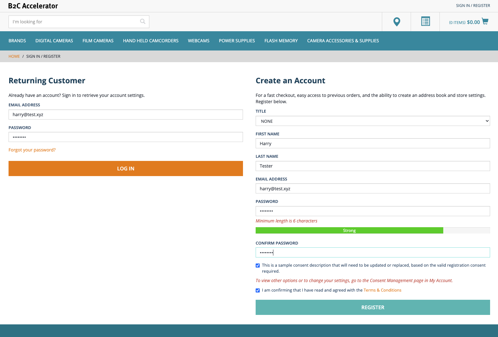

2. In Kyma dashboard, navigate to the event processing Serverless Function. In the section `Replicas of the Function`, you can find the referenced Pod that hosts the Function logic. Click on the Pod.

    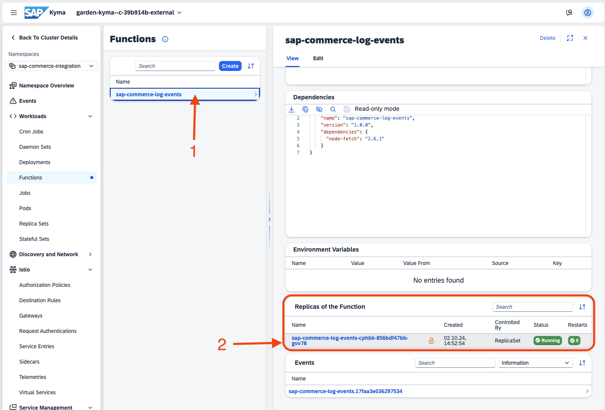

3. In the Pod view, the section `Containers` includes a button to open the log-viewers of the `function` container.

    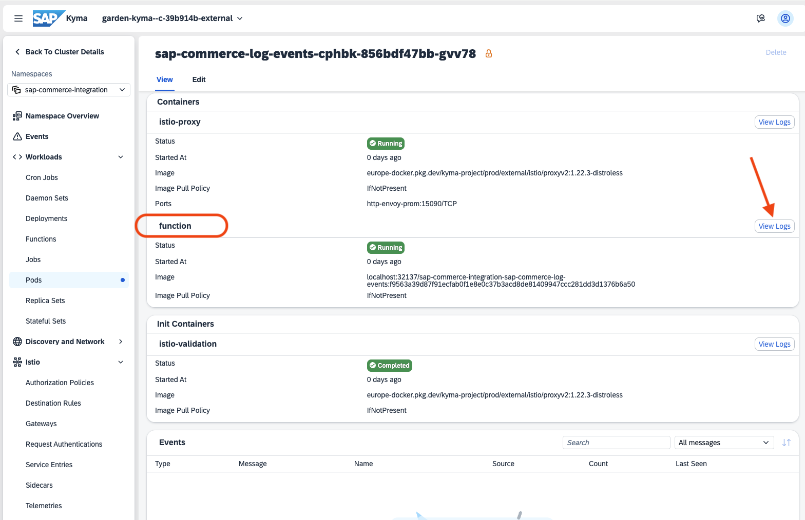

4. The logs show the last received events of the Serverless Function.

    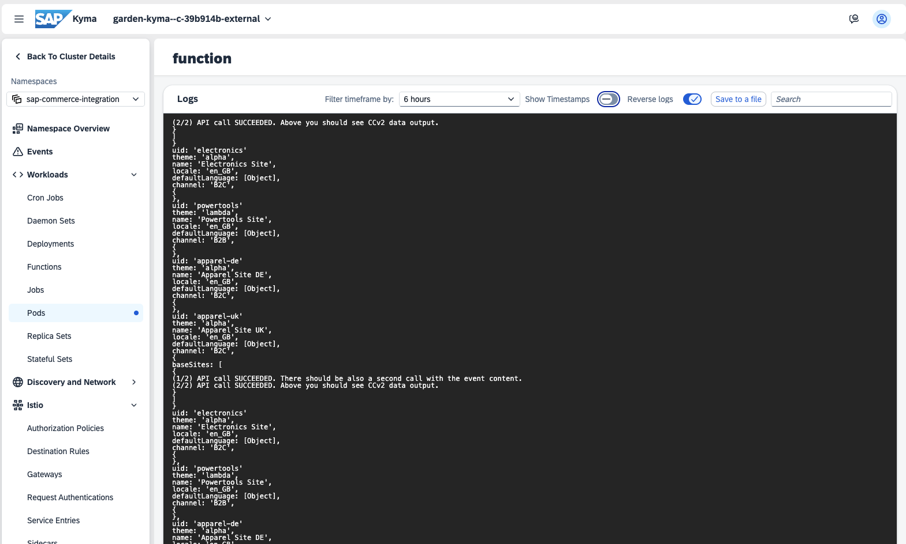

**Well done, your Kyma system is successfully integrated with an SAP Commerce Cloud store and can retrieve and process events from the storefront.**

## Common Problems

### Registration Fails Due to Token URL Invalidity

Mind that the Token URL is valid for a limited time. Once you copy the URL, paste it into SAP Commerce Cloud as quickly as possible. Mind that if the URL is sent via Slack, it will become invalid (Slack will open it to show a preview).

### Registration Fails Due to Connectivity Issues

If SAP Commerce Cloud cannot communicate with Compass/Kyma, the registration fails instantaneously.

### Serverless Function Is Not Triggered

This is the most difficult issue to troubleshoot, as there are a number of potential causes. In general, either SAP Commerce Cloud is not sending events or Kyma is not triggering the Function. You must verify that:

* The Function is triggered when the event is received. You can send an event manually and check whether the Function is called.
* The event has been sent on the SAP Commerce Cloud side. You can check the **Event Notification Monitoring** panel, where all events are logged. Check if there is any error message logged about your event. If you notice that your event was not sent correctly, you can try deleting the consumer and recreating it from scratch.
